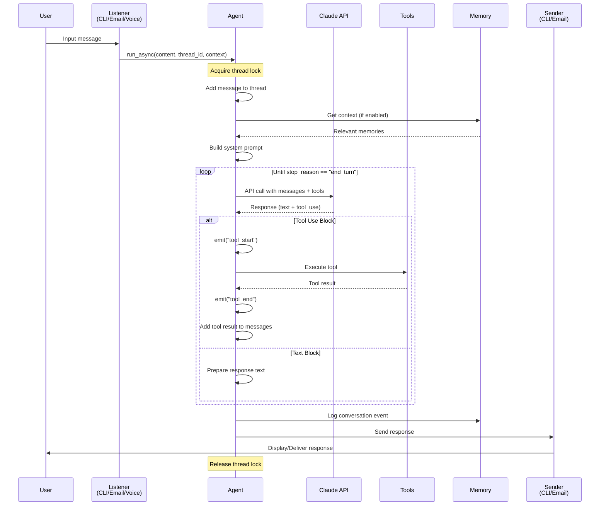
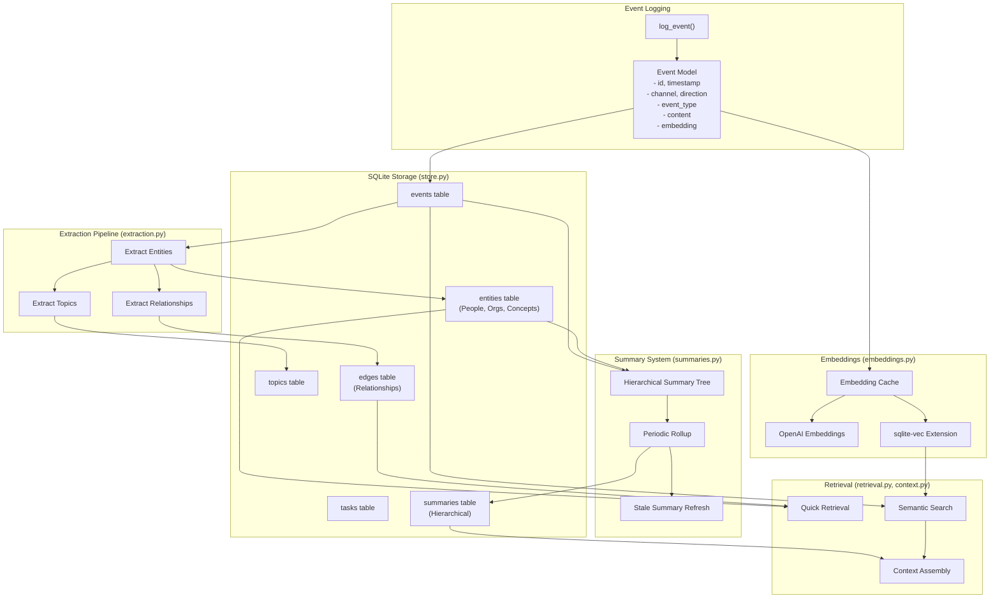
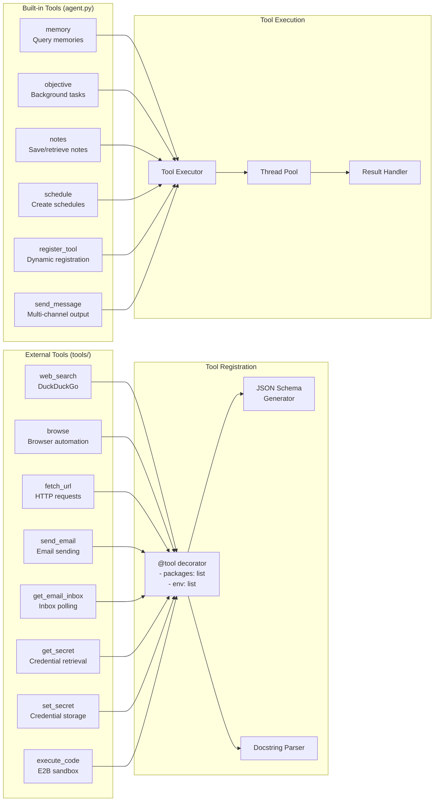
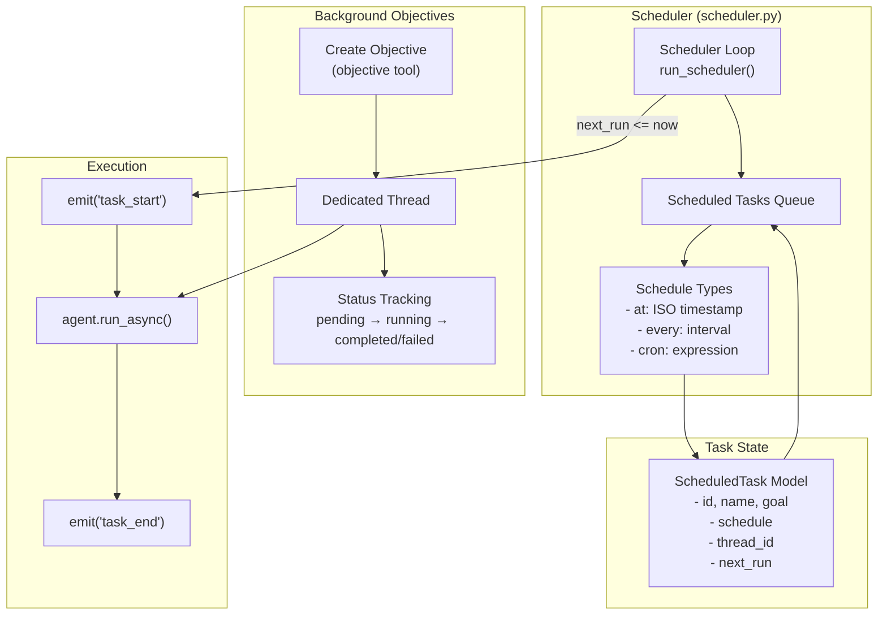
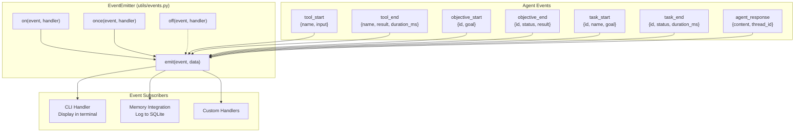
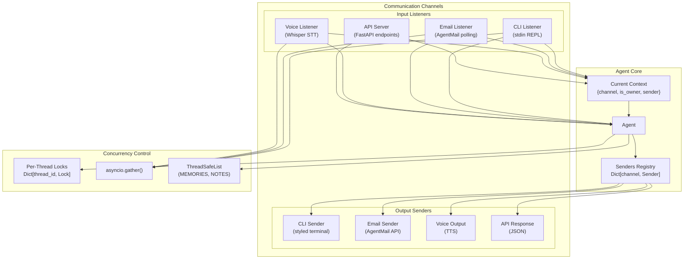
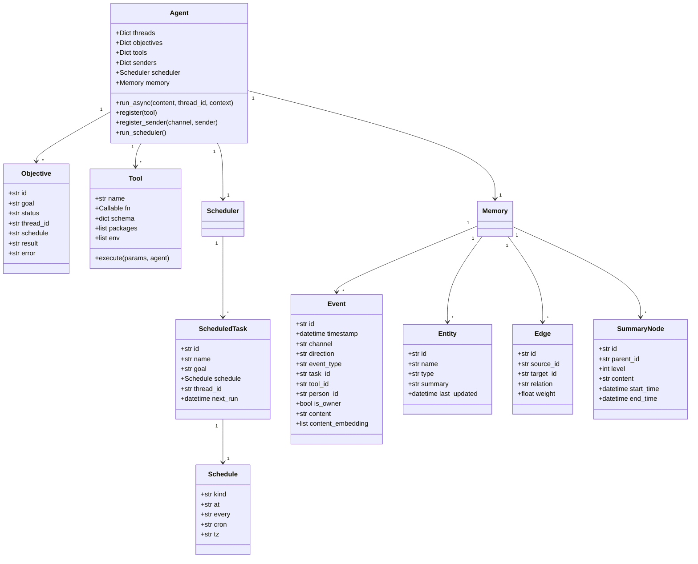
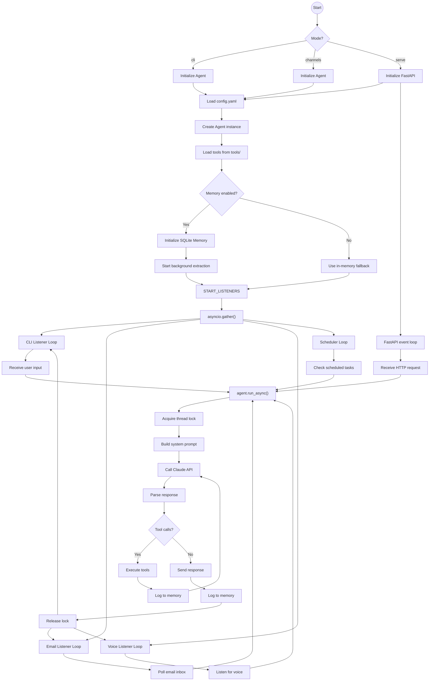

# BabyAGI v0.3.0 Architecture

This document provides a comprehensive visual overview of the BabyAGI codebase architecture using Mermaid diagrams.

## High-Level System Architecture

```mermaid
flowchart TB
    subgraph Entry["Entry Points (main.py)"]
        CLI_MODE["CLI Mode<br/>python main.py"]
        CHANNELS_MODE["Channels Mode<br/>python main.py channels"]
        SERVER_MODE["Server Mode<br/>python main.py serve"]
    end

    subgraph Config["Configuration"]
        CONFIG_YAML["config.yaml"]
        ENV_VARS["Environment Variables"]
        CONFIG_PY["config.py<br/>ConfigLoader"]
    end

    subgraph Core["Agent Core (agent.py)"]
        AGENT["Agent Class"]
        THREADS["threads: Dict[str, List[Message]]"]
        OBJECTIVES["objectives: Dict[str, Objective]"]
        SCHEDULER["Scheduler<br/>(scheduler.py)"]
        EVENT_EMITTER["EventEmitter<br/>(utils/events.py)"]
    end

    subgraph Listeners["Input Channels (listeners/)"]
        CLI_LISTENER["cli.py<br/>CLI REPL"]
        EMAIL_LISTENER["email.py<br/>Email Poller"]
        VOICE_LISTENER["voice.py<br/>Voice Input"]
    end

    subgraph Senders["Output Channels (senders/)"]
        CLI_SENDER["cli.py<br/>Terminal Output"]
        EMAIL_SENDER["email.py<br/>Email Output"]
    end

    subgraph Tools["Tools System (tools/)"]
        TOOL_DECORATOR["@tool Decorator"]
        WEB_TOOLS["web.py<br/>search, browse, fetch"]
        EMAIL_TOOLS["email.py<br/>send, check inbox"]
        SANDBOX["sandbox.py<br/>Code Execution (E2B)"]
        SECRETS["secrets.py<br/>Credential Storage"]
        VERBOSE["verbose.py<br/>Logging Control"]
    end

    subgraph Memory["Memory System (memory/)"]
        MEMORY_FACADE["Memory Facade<br/>(__init__.py)"]
        STORE["MemoryStore<br/>(store.py)"]
        EXTRACTION["ExtractionPipeline<br/>(extraction.py)"]
        SUMMARIES["SummaryManager<br/>(summaries.py)"]
        CONTEXT["ContextAssembler<br/>(context.py)"]
        RETRIEVAL["QuickRetrieval<br/>(retrieval.py)"]
        EMBEDDINGS["Embeddings<br/>(embeddings.py)"]
    end

    subgraph External["External Services"]
        CLAUDE["Anthropic Claude API"]
        E2B["E2B Sandbox"]
        AGENTMAIL["AgentMail API"]
        DUCKDUCKGO["DuckDuckGo Search"]
        BROWSER_USE["Browser Use Cloud"]
    end

    subgraph Storage["Data Storage"]
        SQLITE["SQLite Database"]
        KEYRING["Encrypted Keyring"]
    end

    %% Entry flow
    CLI_MODE --> AGENT
    CHANNELS_MODE --> AGENT
    SERVER_MODE --> AGENT

    %% Config flow
    CONFIG_YAML --> CONFIG_PY
    ENV_VARS --> CONFIG_PY
    CONFIG_PY --> AGENT

    %% Agent connections
    AGENT --> THREADS
    AGENT --> OBJECTIVES
    AGENT --> SCHEDULER
    AGENT -.-> EVENT_EMITTER
    AGENT --> CLAUDE

    %% Listeners to Agent
    CLI_LISTENER --> AGENT
    EMAIL_LISTENER --> AGENT
    VOICE_LISTENER --> AGENT

    %% Agent to Senders
    AGENT --> CLI_SENDER
    AGENT --> EMAIL_SENDER

    %% Tools registration
    TOOL_DECORATOR --> AGENT
    WEB_TOOLS --> TOOL_DECORATOR
    EMAIL_TOOLS --> TOOL_DECORATOR
    SANDBOX --> TOOL_DECORATOR
    SECRETS --> TOOL_DECORATOR
    VERBOSE --> TOOL_DECORATOR

    %% Memory system
    AGENT --> MEMORY_FACADE
    MEMORY_FACADE --> STORE
    MEMORY_FACADE --> EXTRACTION
    MEMORY_FACADE --> SUMMARIES
    MEMORY_FACADE --> CONTEXT
    MEMORY_FACADE --> RETRIEVAL
    MEMORY_FACADE --> EMBEDDINGS
    STORE --> SQLITE

    %% External services
    WEB_TOOLS --> DUCKDUCKGO
    WEB_TOOLS --> BROWSER_USE
    EMAIL_TOOLS --> AGENTMAIL
    EMAIL_LISTENER --> AGENTMAIL
    EMAIL_SENDER --> AGENTMAIL
    SANDBOX --> E2B
    SECRETS --> KEYRING

    %% Event subscriptions
    EVENT_EMITTER -.-> CLI_LISTENER
    EVENT_EMITTER -.-> MEMORY_FACADE
```

## Message Processing Flow

## Memory System Architecture

## Tool System Architecture

## Scheduler and Background Objectives

## Event System

## Multi-Channel Architecture

## Data Models

## File Structure Overview

```mermaid
flowchart TB
    subgraph Root["babyagi/"]
        MAIN["main.py<br/>Entry point"]
        AGENT_PY["agent.py<br/>Core Agent class"]
        SCHEDULER_PY["scheduler.py<br/>Task scheduling"]
        CONFIG_PY["config.py<br/>Config loader"]
        CONFIG_YAML["config.yaml<br/>Settings"]
        SERVER_PY["server.py<br/>FastAPI server"]
    end

    subgraph MemoryDir["memory/"]
        MEM_INIT["__init__.py<br/>Memory facade"]
        STORE_PY["store.py<br/>SQLite backend"]
        MODELS_PY["models.py<br/>Data models"]
        CONTEXT_PY["context.py<br/>Context assembly"]
        EXTRACT_PY["extraction.py<br/>NLP pipeline"]
        RETRIEVAL_PY["retrieval.py<br/>Search"]
        SUMMARIES_PY["summaries.py<br/>Summary tree"]
        EMBED_PY["embeddings.py<br/>Vector embeddings"]
        INTEG_PY["integration.py<br/>Event hooks"]
    end

    subgraph ListenersDir["listeners/"]
        L_CLI["cli.py<br/>CLI REPL"]
        L_EMAIL["email.py<br/>Email poller"]
        L_VOICE["voice.py<br/>Voice input"]
    end

    subgraph SendersDir["senders/"]
        S_INIT["__init__.py<br/>Sender protocol"]
        S_CLI["cli.py<br/>Terminal output"]
        S_EMAIL["email.py<br/>Email output"]
    end

    subgraph ToolsDir["tools/"]
        T_INIT["__init__.py<br/>Tool framework"]
        T_WEB["web.py<br/>Web tools"]
        T_EMAIL["email.py<br/>Email tools"]
        T_SANDBOX["sandbox.py<br/>Code execution"]
        T_SECRETS["secrets.py<br/>Credentials"]
        T_VERBOSE["verbose.py<br/>Logging"]
    end

    subgraph UtilsDir["utils/"]
        U_EVENTS["events.py<br/>EventEmitter"]
        U_CONSOLE["console.py<br/>Terminal styling"]
    end

    MAIN --> AGENT_PY
    MAIN --> SERVER_PY
    AGENT_PY --> SCHEDULER_PY
    AGENT_PY --> CONFIG_PY
    CONFIG_PY --> CONFIG_YAML
    AGENT_PY --> MEM_INIT
    AGENT_PY --> L_CLI
    AGENT_PY --> T_INIT
    AGENT_PY --> U_EVENTS
```

## Complete System Flow

---

## Key Architectural Principles

1. **Everything is a Message**: User input, agent responses, tool execution, and background work all flow through the same message processing pipeline.

2. **Event-Driven Architecture**: The `EventEmitter` mixin enables loose coupling between components. Listeners subscribe to events without tight dependencies.

3. **Thread-Safe Concurrency**: Per-thread locks ensure serialized access to conversation threads, while `ThreadSafeList` protects shared data structures.

4. **Pluggable Channels**: Input listeners and output senders implement simple protocols, making it easy to add new communication channels.

5. **Graceful Degradation**: The memory system falls back to in-memory storage if SQLite is unavailable, ensuring the agent remains functional.

6. **Background Processing**: Objectives and scheduled tasks run independently in their own threads/tasks, not blocking the main conversation flow.

7. **Decorator-Based Tools**: The `@tool` decorator provides automatic JSON schema generation, dependency tracking, and registration.
